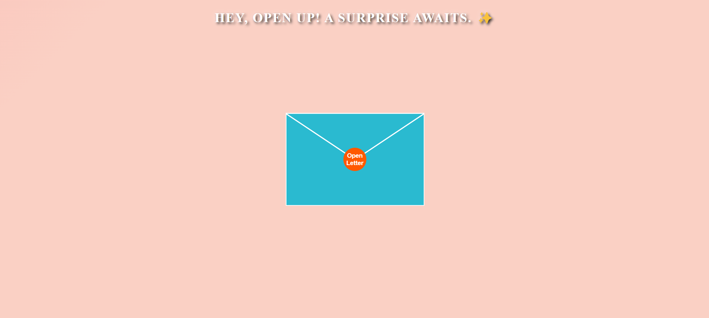

# Letter To You 💌

A heartfelt digital letter and envelope animation built with React. This project allows you to send a beautiful, interactive letter to someone special.

## Preview 🖼️

Here’s a sneak peek of the project:



## Inspiration 💡

This project was inspired by the timeless tradition of writing letters to express love and gratitude. In a digital age, I wanted to recreate the magic of receiving a heartfelt letter with a modern, interactive twist.

## How It Works 🛠️

1. **Envelope Animation**: When the user clicks the "Open Letter" button, the envelope opens with a smooth animation, revealing the letter inside.
2. **Letter Content**: The letter contains a heartfelt message, which can be customized to suit your needs.
3. **Heart Page**: After reading the letter, the user can navigate to a "Heart" page by clicking the "Click Here" link.

## Features ✨

- **Interactive Envelope Animation**: Click to open the envelope and reveal the letter.
- **Responsive Design**: Works seamlessly on all devices.
- **Customizable Content**: Easily edit the letter content to make it personal.
- **Routing**: Navigate to a "Heart" page after opening the letter.

## Technologies Used 🛠️

- **React**: For building the user interface.
- **React Router**: For handling navigation between pages.
- **CSS**: For styling and animations.
- **GitHub Pages**: For deployment.

## Live Demo 🌐

Check out the live demo here:  
👉 [Letter To You](https://mannatgupta146.github.io/Letter-To-You)


## How to Run Locally 🚀

Follow these steps to run the project on your local machine:

1. **Clone the repository**:
```git clone https://github.com/mannatgupta146/Letter-To-You.git```

2. **Navigate to the project directory**:
```cd Letter-To-You```

3. **Install dependencies**:
```npm install```

4. **Start the development server**:
```npm start```

5. **Open your browser**:
Visit http://localhost:3000 to view the project.   

## Contributing 🤝

Contributions are welcome! If you'd like to improve this project, follow these steps:

1. Fork the repository.
2. Create a new branch (`git checkout -b feature/YourFeatureName`).
3. Commit your changes (`git commit -m 'Add some feature'`).
4. Push to the branch (`git push origin feature/YourFeatureName`).
5. Open a pull request.

## Acknowledgments 🙏

- Inspired by the idea of sending heartfelt digital letters.
- Built with ❤️ using React.

---
***This is for you, now and always.💌